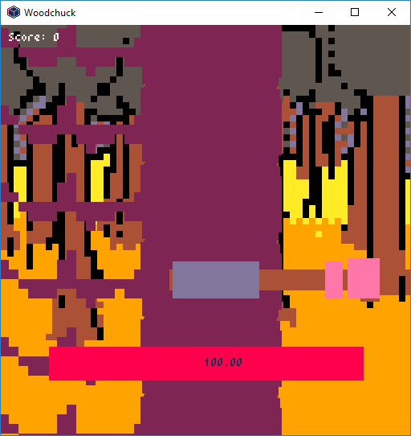

# woodchuck
Woodchuck - a Pyxel made tree cutting simulator

This piece of code is what you can cook up in a few moments with @kitao's excellent Pyxel - minimalistic game engine:

https://github.com/kitao/pyxel

## Installation

As I haven't ported the game to a frozen exe or other executables the way to run it now is to install Python v3.7+ and install with pip:

`pip install pyxel`

After that just run the game with:

`python main.py`

Enjoy :)

## Controls

Enter - start game

A-D chop left / right

Q - exit game
